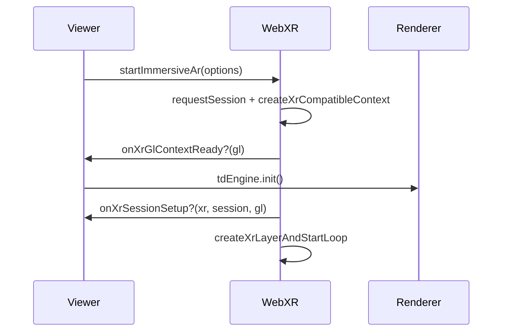

# Using the default XR engine

sparcl is currently built around the WebXR `immersive-ar` module. As this specification is still under development, sparcl can't currently be used for an end user facing application.

This is why we aim to keep WebXR specific code separate from the main code. The `Viewer` acts like a controller to make this work. A fallback XR engine for devices not supporting WebXR is already in sight. Work on this might start sooner or later.

So far, the separation is there, but there is no specific 'API' between the `Viewer` and an XR engine. This will likely be worked on when the fallback XR engine is available.

When you try this feature and run into problems, feel free to let us know.

As always, please share you feedback with us. Pull requests are more than welcome.

## Starting an immersive AR session

WebXR requires a WebGL context with XR support (`WebGL2RenderingContext` with flag `{xrCompatible: true}`). Neither OGL nor Three.js creates that context by default, so the order of operations is fixed and easy to get wrong if callers manage each step themselves.



Use a single orchestrator instead:

```ts
await xrEngine.startImmersiveAr({
    canvas,
    xrSessionOptions, // XRSessionInit: features, domOverlay, trackedImages, etc.
    onXrGlContextReady: () => tdEngine.init(), // attach renderer to xrCompatible GL context
    onXrSessionSetup?, // optional: binding, camera capture, hit-test (after renderer attach)
    onXrFrameUpdate?, // optional: pose frames (OSCP / experiments render from here)
    onXrMarkerFrameUpdate?, // optional: image-tracking frames (Marker mode)
    onXrSessionEnded?,
    onXrNoPose?, // optional: called when getViewerPose returns null
});
```

`webxr` runs this pipeline internally in a fixed order:

1. `navigator.xr.requestSession('immersive-ar', xrSessionOptions)`
2. Create the XR-compatible WebGL2 context and reference spaces
3. `onXrGlContextReady?` — attach/resize the rendering engine (`tdEngine.init()`); do not call `init()` yourself outside this hook for XR startup
4. `onXrSessionSetup?` — per-session XR feature wiring (e.g. `initCameraCapture`, hit-test)
5. Create `XRWebGLLayer` and start the `requestAnimationFrame` loop

`webxr` does not import or know about `RenderingEngine`; the viewer composes the two engines via `onXrGlContextReady`.

All callbacks are optional. Omit any you do not need; `webxr` does not render 3D content itself. Callers that need graphics must pass `onXrFrameUpdate` and/or `onXrMarkerFrameUpdate` and call `tdEngine.render()` from those handlers when a pose is available.

When tracking is lost (`getViewerPose` is null), `onXrNoPose(time, frame)` is invoked. Do not call `tdEngine.render()` from that callback — there is no view to render.
